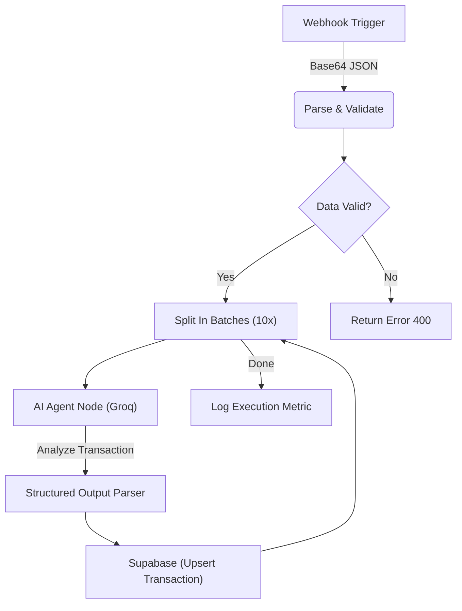
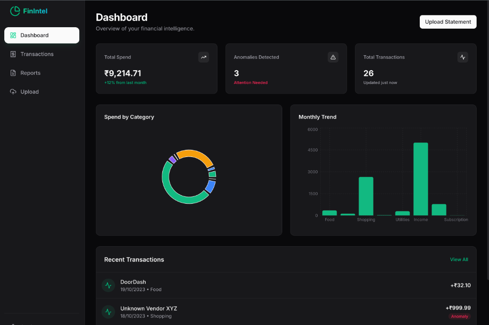

# 🤖 AI Finance Agent (n8n + Llama 3)
> **An Autonomous Financial Analyst Agent orchestrated with n8n.**
> 
> *Demonstrating enterprise-grade process automation, AI agent integration, and human-in-the-loop workflows.*


## 🎯 Automation Engineering Highlights

This project demonstrates a production-ready **Agentic Workflow** that automates a complex financial reporting process. It moves beyond simple "Zapier-style" triggers to accurate, multi-step orchestration.

**Core Automation Capabilities:**
- **Advanced Flow Control:** Implements `SplitInBatches` to handle large CSV datasets without timeouts.
- **AI Agent Integration:** Custom Javascript logic to prepare prompts for **Llama 3 (via Groq)**, enabling context-aware data enrichment.
- **Resilient Error Handling:** Robust parsing logic to handle malformed uploads and API failures.
- **Event-Driven Architecture:** Decoupled frontend (Next.js) triggering asynchronous webhooks.

## ⚙️ Workflow Architecture (n8n)

The core value lies in the **n8n orchestration layer**:



### Technical Workflow Breakdown
1.  **Ingestion & Validation:** Receives raw CSV payloads via Webhook. Custom JS nodes validate schema integrity before processing.
2.  **Batch Processing:** Uses `SplitInBatches` node to process transactions in chunks. This ensures scalability when processing bank statements with 1000+ rows.
3.  **Local AI Inference:** Calls **Llama 3-8b** via Groq API.
    *   *Prompt Engineering:* "You are a financial analyst. Classify '${description}' and score anomaly probability 0-1."
4.  **Database Sync:** Upserts enriched data into **Supabase** (PostgreSQL) with conflict resolution.

## � Project Structure

Here is a quick overview of the codebase organization:

```bash
finance-intelligence-system/
├── app/                    # Next.js App Router (Frontend + API)
│   ├── api/                # Serverless API Routes (Report Gen, Upload, Reset)
│   ├── reports/            # Generated Reports Page (PDF Export)
│   ├── settings/           # System & Data Management
│   ├── transactions/       # Transaction Grid with Actions
│   └── upload/             # Drag-and-drop CSV Upload Zone
├── components/             # Reusable UI Components (Shadcn + Tailwind)
├── lib/                    # Shared Utilities (Supabase Client, Types)
├── n8n/                    # Automation Workflows
│   └── workflow.json       # The core "Brain" (Import this into n8n)
├── supabase/               # Database Configuration
│   └── schema.sql          # SQL Migration for Transactions/Reports tables
└── public/                 # Static Assets
```

## 🖥️ Frontend layer (Next.js)



While n8n handles the brains, a lightweight **Next.js** dashboard serves as the control plane for the user to upload files and view the resulting analytics.

## 🛠️ Tech Stack

- **Frontend:** Next.js 15 (App Router), TypeScript, Tailwind CSS, Lucide React
- **Backend:** Next.js API Routes (Serverless)
- **Database:** Supabase (PostgreSQL)
- **AI/LLM:** Groq (Llama 3-8b-instant)
- **Automation:** n8n (Self-hosted or Cloud)
- **PDF Generation:** jsPDF

## 📦 Installation & Setup

### 1. Database (Supabase)
Run the SQL migration in `supabase/schema.sql` to create the `transactions`, `reports`, and `execution_logs` tables.

### 2. Automation (n8n)
Import `n8n/workflow.json` into your n8n instance. 
*Requires `GROQ_API_KEY` and Supabase credentials.*

### 3. Frontend
```bash
# Install dependencies
npm install

# Configure Environment
cp .env.example .env.local
# Add: NEXT_PUBLIC_SUPABASE_URL, NEXT_PUBLIC_SUPABASE_ANON_KEY, NEXT_PUBLIC_N8N_WEBHOOK_URL, SUPABASE_SERVICE_ROLE_KEY

# Run
npm run dev
```

## 🔮 Future Roadmap

- [ ] Multi-tenant Authentication (Clerk/Supabase Auth).
- [ ] Direct Plaid/Stripe integration for bank feeds.
- [ ] Vector Search for "Show me all coffee purchases" semantic queries.
